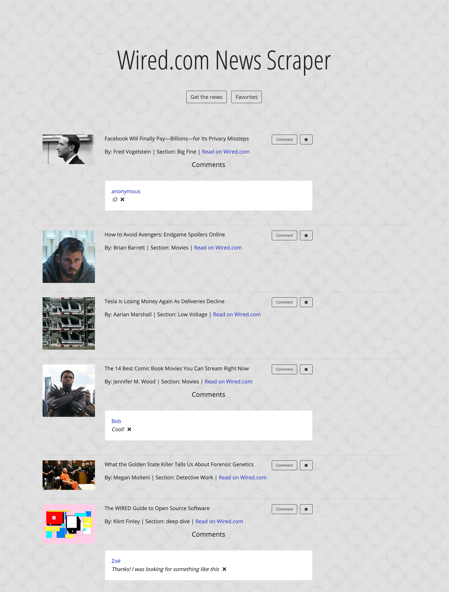

# Wired.com News Scraper

## Overview
This app scrapes and displays headlines from Wired.com, allowing users to then star and comment on those articles. All data is stored in a Mongo database.

## Tools used
MongoDB, Mongoose, Cheerio, Express, Handlebars, jQuery, Bootstrap

## Getting started
Navigate to the [homepage](https://desolate-stream-48224.herokuapp.com/).

Click **Get the news** button to view previous articles as well as retrieve new ones based on current Wired headlines. Click **Favorites** to view starred articles.

Add comments. Validation is in place to prevent blank fields.

Delete comments upon confirmation.

Additionally, articles can be added to and removed from the favorites section.